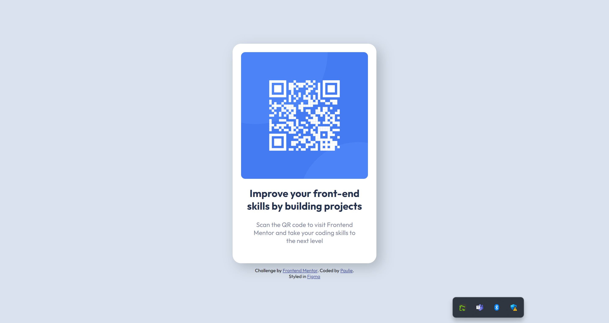
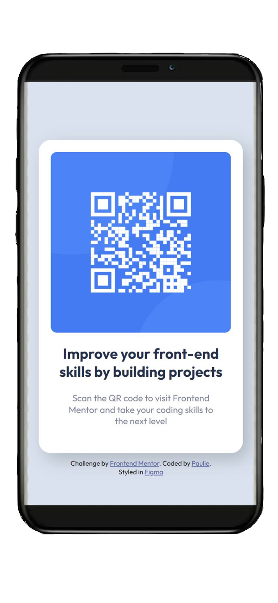

# Frontend Mentor - QR code component solution

This is a solution to the [QR code component challenge on Frontend Mentor](https://www.frontendmentor.io/challenges/qr-code-component-iux_sIO_H). Frontend Mentor challenges help you improve your coding skills by building realistic projects.

## Table of contents

- [Overview](#overview)
  - [Screenshot](#screenshot)
  - [Links](#links)
- [My process](#my-process)
  - [Built with](#built-with)
  - [What I learned](#what-i-learned)
  - [Continued development](#continued-development)
  - [Useful resources](#useful-resources)
- [Author](#author)
- [Acknowledgments](#acknowledgments)

**Note: Delete this note and update the table of contents based on what sections you keep.**

## Overview

### Screenshot

### Links

- Solution URL: [Add solution URL here](https://your-solution-url.com)
- Live Site URL: [Add live site URL here](https://your-live-site-url.com)

## My process

### Built with

- HTML
- Mostly vanilla CSS
- Tiny bit o' Flexbox

### What I learned

This was a good exercise for me because it's been awhile since I've worked with CSS. It was a nice, easy reintroduction to how CSS and HTML work together.

### Continued development

I'm still pretty rusty with CSS so I'm definitely looking forward to some feedback on how I can improve this project. I think I'd also like to start learning some sort of CSS programming language like Sass or Less, but I'm unsure which at this point. Also to work more on responsive design, as that's something I was never super confident in.
